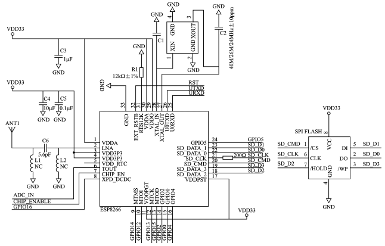
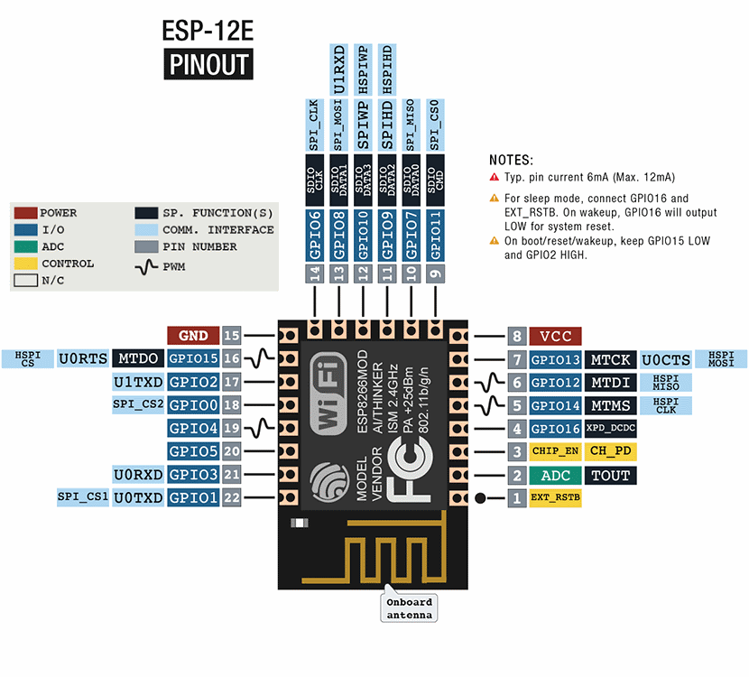

# Regulátor teploty s ESP8266

### Zadání Práce
Prostudujte problematiku elektronického měření teploty. Navrhněte a vyrobte elektronický regulátor teploty s ESP8266. Ten bude spínáním externího topení udržovat teplotu ve stanoveném intervalu. Uvažujte rozsah teplot alespoň -20 až 50 stupňů Celsia. Zařízení bude napájené z externího zdroje. Regulátor se bude konfigurovat prostřednictvím webového rozhraní, kde bude také vidět průběh teplot a stav sepnutí externího topení. Naměřená data budou také odesílána na cloudovou službu pro IoT analýzu dat typu ThingSpeak apod. V rámci semestrálního projektu prostudujte problematiku elektronického měření teploty. Navrhněte schéma a navrhněte a vyrobte desku plošných spojů regulátoru teploty.

### Rozdělení projektu na dílčí části
* prostudování problematiky výber komponet
* výběr vhodného teplotního čidla
* rozbor cloudové služby pro IoT
* návrh DPS (prototyp)
* napsání frimwaru
* návrh finální DPS výroba
* Sepsání dokumentace/práce   

### Realizace projektu

Pro projekt jsem se rozhodl použít ESP8266 a to v provedení ESP-12F. Jedná se o malou destičku, na které je osazen IC ESP8266EX (od něho je odvozen výsledný název) a EEPROM pamět (Flash). Na destičce dále nalezneme několik rezistorů, kondenzátorů, cívek a jeden krystal který taktuje celý obvod. viz schéma zapojení destiky. Za povšimnutí také stojí anténa pro pásmo 2.4GHz, která je realizovaná na DPS a je dopněma LC filtrem typu horní propust (C6, L1, L2).

#### Schéma destičky ESP-XX

   

Na obrázku můžme vidět pomocí kterých pinů (SPI sběrnice) je k IC připojena Flash pamět, která u mnou zvolené destičky má velikost 4MB.

#### Parametry IC ESP8266EX

* **CPU:** Tensilica L106 32-bit processor
* **I/O rozhraní:** UART/SDIO/SPI/I2C/I2S/IR Remote Contro GPIO/ADC/PWM/LED Light & Button
* **Napájecí napětí:** 2,5 – 3,6V
* **Odběr proudu: průměrně:** 80mA
* **Teplotní rozsah:** -40 – 125°C
* **Pouzdro:** QFN32-pin (5 mm x 5 mm)

*!Na obrázku můžete vidět ESP-12E to se od ESP-12F liší pouze tvarem antény*

#### ESP266 Boot Options

| **GPIO15** **(MTDO)** | **GPIO0** | **GPIO2** | **Mode** | **Comment** |
| :-: | :-: | :-: | :-: | :-: |
| **L** | **H** | **H** | Flash | Boot form SPI Flash |
| **L** | **L** | **H** | UART  | Programing by UART  |
| **H** | **X** | **X** | SDIO  | Boot form SD-card   |

#### Výběr vhodného teplotního čidla

##### Rozbor problematiky

Teplota je jednou ze základních veličin SI soustavy, její jednotka je [K]. V našich končinách se spíše setkáme s jednoutkou stpeň Celsia [°C], která je odvozena od trojného bodu vody. Přepočet mezi těmito jednotkami je velice snadný:

Teplotní čidlo slouží k eletrickému měření teploty, jeho hlavním úkolem je převod okolní teploty na nějakou elektrickou veličinu (odpor, poud, napětí). Čidla můžeme dělit podle mnoha faktorů asi nejzásadnější z nich je jestli je čidlo dotykové nebo ne. V naší aplikaci by bezdotykoké čidlo nemělo smysl, stejně tak by nemělo smysl se tu zaobýrat čidly, které nejsou elektrická, proto se dále zaměřím pouze na dělení dotykových elektrických čidel.  

##### Eleketrická dotykové čidla:

* Odporová kovová
* Odporová polovodičová
* Termoelektrická
* Polovodičová s NP přechodem

##### Citace

* http://skriptum.wz.cz/autom/teplota.htm

#### IoT cloudové sluby

* https://thingspeak.com/
* https://tmep.cz/
* https://iotguru.live/
* https://login.arduino.cc/
* https://www.openhab.org/
* https://aws.amazon.com/free/
* https://cloud.ibm.com/login
* https://cloud.google.com/iot-core
* https://www.fogwing.io/
* https://www.axonize.com/platform/
* https://blynk.io/
* https://www.torryharris.com/products/iot-glue-integration-platform
* https://www.datadoghq.com/product/
* https://www.ixon.cloud/iiot-platform
* https://www.bevywise.com/iot-platform/

##### Citace

* LinuxDays - 3.10.2020 - IoT domov aneb pozvěte si zloděje domů (Petr Šrámek)
* LinuxDays - 3.10.2020 - PiHome - automatizace domácnosti s OpenHAB běžící na Raspberry Pi & Arduino (Michal Novotný)
* LinuxDays - 10.10.2015 - MQTT, protokol pro IoT (Adam Hořčica)

#### CITACE 2

[a1] https://dspace.vutbr.cz/bitstream/handle/11012/17665/final-thesis.pdf?sequence=6
[a2] http://remaxcz.com/old/katalog/snimace/teplota/kl/char/Pt100.pdf
[a4] 
[a5] http://www.ferity.cz/termistory/negohm.pdf
[a6]https://vyvoj.hw.cz/teorie-a-praxe/dokumentace/mereni-teploty-polovodicove-odporove-senzory-teploty.html
[a7] https://cdn.sparkfun.com/datasheets/Sensors/Temp/DS18B20.pdf
[a8] http://robotchip.ru/download/datasheet/AM2302-Datasheet.pdf
[a9] Měření teploty termočlánky. Www.vutbr.cz [online]. [cit. 2017-05-07]. Dostupné z: https://www.vutbr.cz/www_base/zav_prace_soubor_verejne.php?file_id=53351
[a10] https://www.vutbr.cz/www_base/zav_prace_soubor_verejne.php?file_id=149118
[a11] 
[a12] https://thingspeak.com/pages/license_faq
[a13] Portál TMEP.cz: Mapa čidel [online]. [cit. 2020-12-06]. Dostupné z: https://tmep.cz/mapa/
[a14] https://www.myopenhab.org/
[a15] https://www.iso.org/standard/69466.html
[a16] https://blogs.mathworks.com/loren/2016/03/23/explore-your-iot-data-with-thingspeak-and-matlab/
[a17] https://escapequotes.net/esp8266-wemos-d1-mini-pins-and-diagram/
[a18] https://jlcpcb.com/
[a19] https://www.kondik.cz/olovnata-a-bezolovnata-pajka

